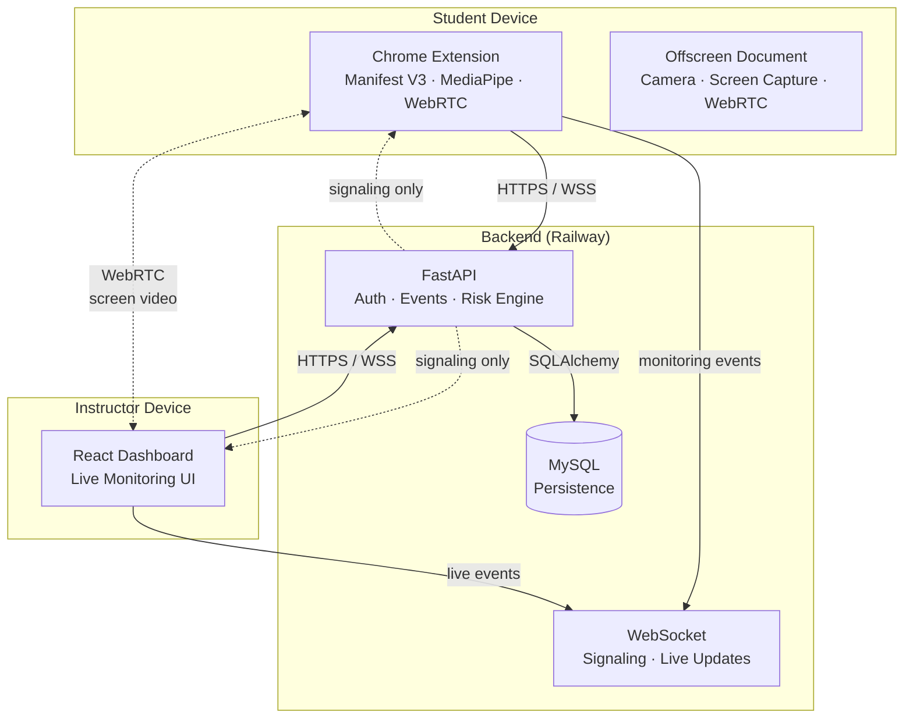

# ProctorAI

**Intelligent Real-Time Exam Monitoring System**

ProctorAI is a privacy-first, LMS-independent exam monitoring system that combines local on-device AI, browser monitoring signals, real-time risk scoring, and consent-based live screen review. It provides the monitoring layer between students taking exams and instructors supervising them — without replacing or integrating with any specific LMS.

| | |
|---|---|
| **Production frontend** | Live |
| **Production backend** | Live |
| **MySQL persistence** | Live |
| **Chrome Manifest V3 extension** | Working |
| **Cross-laptop live monitoring** | Validated |
| **Consent-based WebRTC screen review** | Validated |

**Live instructor dashboard:** https://lovely-harmony-production.up.railway.app

**Privacy policy:** https://lovely-harmony-production.up.railway.app/privacy

---

## Problem

Remote exams create real monitoring challenges:

- Instructors cannot watch every candidate continuously.
- Manual observation is inconsistent and does not scale.
- Traditional proctoring tools are intrusive and erode student trust.
- Heavy recording and cloud-based AI processing create serious privacy concerns.

Most existing solutions record students, upload camera footage to external servers, or rely on invasive biometric identification. ProctorAI takes a different approach.

---

## Solution

ProctorAI monitors students through their browser and local on-device AI — without recording, uploading, or storing any media.

**The monitoring flow:**

1. Instructor creates a monitoring session.
2. Student joins using a session code through the Chrome extension.
3. Browser signals and local AI generate monitoring events on the student's device.
4. FastAPI backend validates and stores events server-authoritatively.
5. Monitoring Risk score updates in real time.
6. Instructor sees a live participant dashboard.
7. HIGH or CRITICAL participants can be reviewed through consent-based live screen sharing.

ProctorAI is **monitoring software**, not an exam-question or grading LMS. It does not manage exam content, grade answers, or replace university examination systems.

---

## Core Features

- **Instructor authentication** — JWT-based registration and login
- **Monitoring session lifecycle** — DRAFT, WAITING, LIVE, ENDED, CANCELLED
- **Student join via session code** — no account required for students
- **Live participant dashboard** — real-time roster, risk scores, event history
- **Real-time WebSocket monitoring** — events appear within seconds
- **Monitoring Risk score (0–100)** — server-computed, instructor-facing attention signal
- **Event history** — timestamped, per-participant event log
- **Session persistence** — MySQL-backed, survives backend restarts
- **Session deletion** — where lifecycle rules permit (DRAFT, CANCELLED)

### Monitoring Signals

| Category | Signals |
|---|---|
| AI-detected (local) | phone detected, multiple faces, suspicious object, no face, camera obscured, looking away |
| Browser-rule events | fullscreen exit, tab switch, window minimized, window maximized, window restored, browser side panel, exam-window focus lost |

Browser-rule events are generated by DOM and window-state APIs. They do not use AI confidence percentages.

---

## Privacy by Design

Privacy is the central architectural decision, not an afterthought.

| Principle | Implementation |
|---|---|
| No face recognition | MediaPipe detects face *presence* only — no identity matching |
| No biometric data | No facial embeddings, no fingerprinting |
| Camera frames stay on device | All inference runs locally in the Chrome extension |
| No camera upload | Camera images and video are never transmitted |
| No microphone | Audio is disabled; no speech monitoring |
| No screenshots | No screen capture for evidence |
| No recording | No evidence recording of any kind |
| No screen recording | Live screen review is transient WebRTC video only |
| No keystroke logging | Extension does not capture keyboard input |
| No page-content scraping | Extension does not read page DOM or content |

### Live Screen Review

When an instructor requests a live screen review:

1. The backend sends a signaling request to the student's extension.
2. The student sees an explicit consent overlay.
3. The student must click **Share Entire Screen** to accept.
4. Chrome's native screen picker appears — the student chooses what to share.
5. Screen video is transmitted via WebRTC peer-to-peer to the instructor.
6. The backend handles signaling only — no screen video passes through it.
7. Screen video is never stored or recorded.
8. The student can stop sharing at any time.

Terminology matters: the system reports **Monitoring Risk** and flags participants as **Needs Review**. It does not automatically accuse students of cheating.

---

## Architecture



| Component | Technology | Responsibility |
|---|---|---|
| Chrome Extension | Manifest V3, TypeScript, MediaPipe | Camera monitoring, browser signals, consent overlay |
| Offscreen Document | getDisplayMedia(), WebRTC | Camera AI inference, screen capture, peer connections |
| FastAPI Backend | Python, Pydantic, SQLAlchemy | Auth, event validation, risk scoring, WebSocket signaling |
| MySQL | Railway managed | Session, participant, and event persistence |
| Instructor Dashboard | React, Vite, Tailwind CSS | Live monitoring, session management, screen review viewer |

For live screen review: the student extension and instructor browser establish a **WebRTC peer-to-peer** connection. The backend handles signaling only — no screen video passes through the server.

---

## Technology Stack

| Layer | Technologies |
|---|---|
| Frontend | React, TypeScript, Vite, Tailwind CSS |
| Extension | Chrome Manifest V3, TypeScript, MediaPipe, Offscreen API, WebRTC, chrome.storage |
| Backend | FastAPI, Pydantic, SQLAlchemy, Alembic, WebSockets, PyMySQL |
| Database | MySQL |
| Deployment | Railway (current hackathon hosting) |

### Alibaba Cloud

The architecture was audited and prepared for Alibaba Cloud deployment using an ECS / Nginx / FastAPI / MySQL (or RDS) architecture. Current hackathon hosting uses Railway because Alibaba account verification and resources were unavailable at the time of deployment. ProctorAI is not currently running on Alibaba Cloud.

---

## Risk Engine

The Monitoring Risk score is a **server-authoritative** attention signal, not an automatic cheating verdict.

- Each event type has a predefined weight.
- Repeated events of the same type have **diminishing impact** to avoid runaway scores.
- The score is capped at 100.

| Level | Score Range |
|---|---|
| Normal | 0–9 |
| Low | 10–29 |
| Medium | 30–49 |
| High | 50–74 |
| Critical | 75–100 |

Risk is an **instructor attention signal**. A high score indicates that the participant's behavior warrants closer observation — it is not a verdict.

---

## Live Screen Review

The current production architecture uses `getDisplayMedia()` in the offscreen document — the Chrome-recommended pattern for Manifest V3:

1. Instructor clicks **View Live Screen** on a participant.
2. Backend sends a WebSocket signaling request to the student's extension.
3. Extension displays a consent overlay with Accept and Decline options.
4. Student clicks **Share Entire Screen**.
5. Extension sends `screen_review_accepted` to the backend.
6. Offscreen document calls `navigator.mediaDevices.getDisplayMedia()`.
7. Chrome's native screen picker appears — student selects what to share.
8. Screen `MediaStream` is captured in the offscreen document.
9. WebRTC peer connection is established to the instructor's browser.
10. Instructor receives the live screen video.
11. Student can stop sharing at any time (Chrome's "Stop sharing" control).

**Manifest permissions:** `storage`, `offscreen`, `scripting` — the legacy `desktopCapture` permission was removed when the architecture was refactored to `getDisplayMedia()`.

---

## Local Development

### Prerequisites

- Python 3.12+
- Node.js 18+
- MySQL 8.0+
- Google Chrome (latest)

### Repository Layout

```
ProctorAI/
├── backend/       FastAPI backend
├── frontend/      React instructor dashboard
├── extension/     Chrome Manifest V3 extension
├── docs/          Architecture and deployment documentation
└── scripts/       Build and packaging scripts
```

### Backend

```bash
cd backend
python -m venv .venv
.venv\Scripts\activate            # Windows
# source .venv/bin/activate       # Linux / macOS

pip install -r requirements.txt

# Configure environment
cp .env.example .env
# Edit .env with your MySQL credentials

# Apply database migrations
alembic upgrade head

# Start the development server
uvicorn app.main:app --reload --host 0.0.0.0 --port 8000
```

Verify: `GET http://localhost:8000/api/health`

### Frontend

```bash
cd frontend
npm install
npm run dev
```

Open: http://localhost:5173

### Extension

```bash
cd extension
npm install
npm run build
```

Load the extension in Chrome:

1. Open `chrome://extensions/`
2. Enable **Developer mode**
3. Click **Load unpacked**
4. Select the `extension/dist` directory

---

## Hackathon Student Installation

The Chrome extension is distributed as a sideload package because Chrome Web Store publishing is currently postponed (developer registration fee).

### Installation Steps

1. Download `ProctorAI-Hackathon-0.2.0.zip` from the repository root.
2. Extract the ZIP file.
3. Open `chrome://extensions/` in Google Chrome.
4. Enable **Developer mode** (top-right toggle).
5. Click **Load unpacked**.
6. Select the extracted `ProctorAI-Hackathon-0.2.0/extension` folder.
7. Navigate to the exam page and join using the instructor's session code.

Chrome Web Store readiness was completed (manifest, privacy policy, permission justifications), but publishing is postponed because of the developer registration fee.

---

## Testing

| Suite | Result |
|---|---|
| Extension unit tests | **148 passed** (latest suite) |
| Backend screen-review tests | **20 passed** (after screen-review architecture changes) |
| Backend full hardening suite | **211 / 211 passed** (historical full-suite result) |

Production screen-review fixes were validated across two laptops — consent flow, WebRTC signaling, and getDisplayMedia capture.

---

## Project Status

| Feature | Status |
|---|---|
| Core monitoring | ✅ |
| Browser signals | ✅ |
| Local AI monitoring | ✅ |
| Risk engine | ✅ |
| Instructor dashboard | ✅ |
| Production MySQL | ✅ |
| Railway deployment | ✅ |
| Cross-laptop monitoring | ✅ |
| Live screen review | ✅ |
| Privacy policy | ✅ |
| Hackathon sideload package | ✅ |
| Chrome Web Store publishing | ⏸ Postponed |
| Alibaba live deployment | ⏸ External account/resource blocker |

---

## Future Work

- Alibaba Cloud production deployment (ECS / Nginx / MySQL)
- TURN relay for restrictive network environments
- Chrome Web Store Unlisted publishing
- Reporting and analytics for instructors
- Additional scalability and load testing
- Institutional integrations

These are planned next steps and are not currently implemented.

---

## Documentation

| Document | Description |
|---|---|
| [Architecture](docs/architecture.md) | System design and component boundaries |
| [Data Model](docs/data-model.md) | Entities and relationships |
| [Deployment](docs/deployment.md) | Alibaba Cloud architecture reference |
| [Railway Deployment](docs/deployment-railway.md) | Current live hosting guide |
| [Chrome Web Store](docs/chrome-web-store.md) | Store readiness documentation |
| [Development Phases](docs/development-phases.md) | Feature roadmap |

---

## License

This project was developed for a hackathon demonstration.
